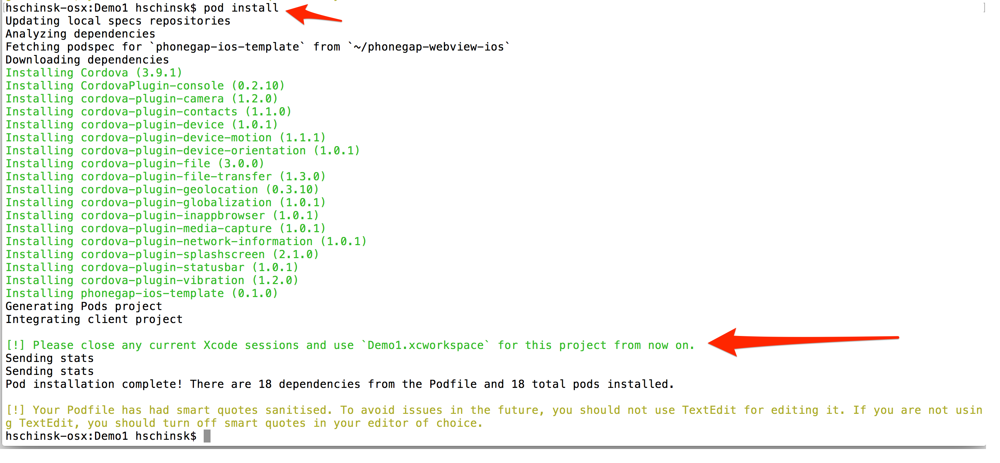
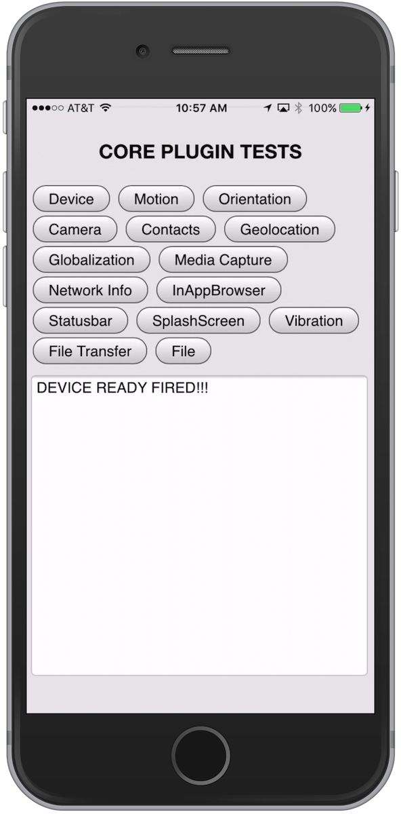
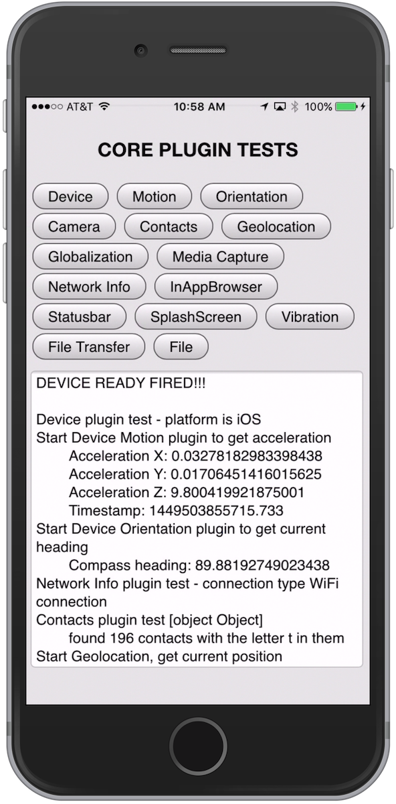
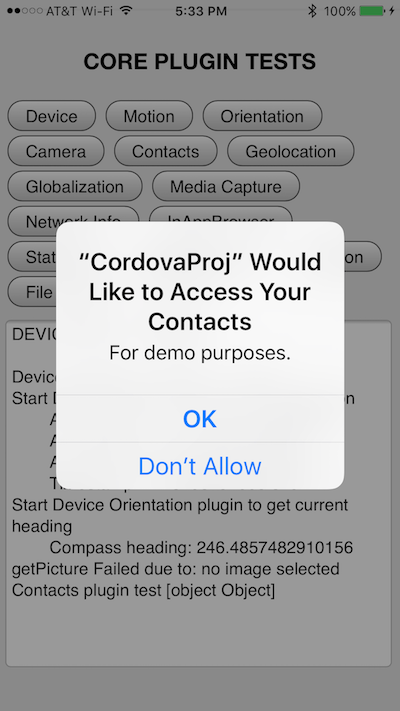
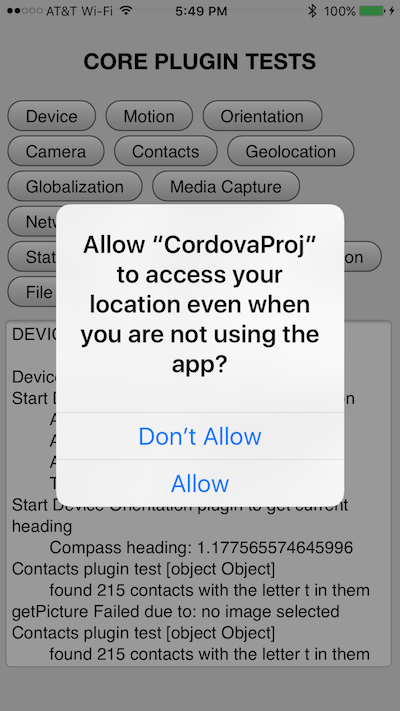
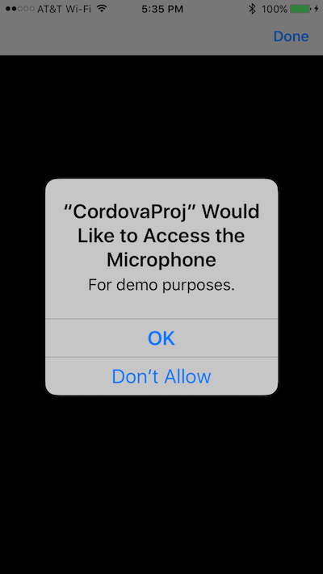
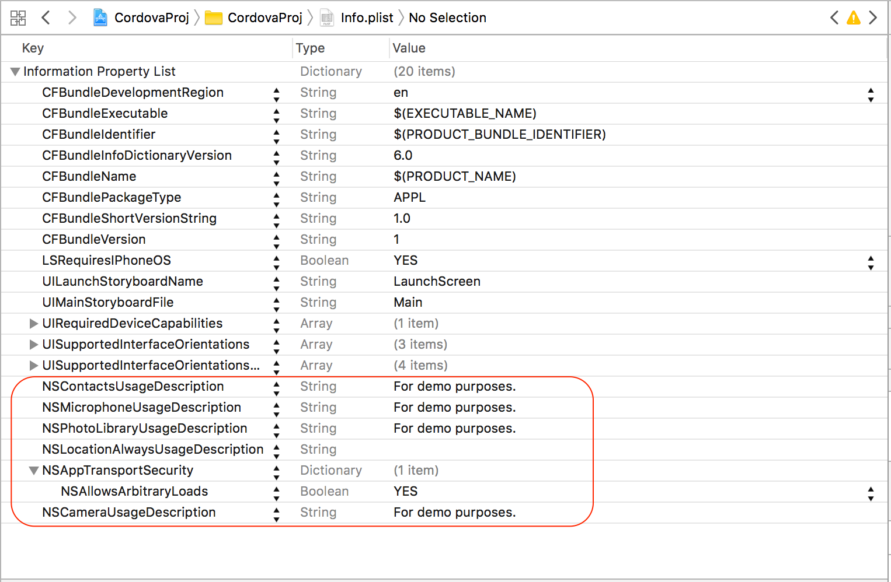
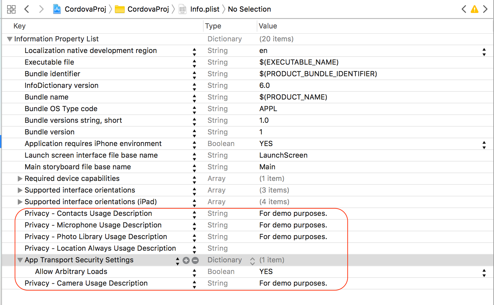

## phonegap-webview-ios

Resources and instructions for adding PhoneGap/Cordova-enabled WebViews into an iOS Native Project (Objective-C or Swift) quickly.

The [PhoneGap Docs - Embedded WebViews section](http://docs.phonegap.com/develop/1-embed-webview/ios/) has a full explanation of 
this approach and why you might want to consider it.   
  

### Quick Start Usage
1. Add the following to your native iOS project Podfile to get this dependency from the CocoaPods registry:	
		
		pod 'phonegap-ios-template'	
	
2. Install the pods referenced in the Podfile from the command line using the CocoaPods `pod` command:

		pod install
	
3. Close your native Xcode project and open the newly created `.xcworkspace` project in the same folder which now includes 
all of the Cordova dependency pods. 

4. You're ready to use any of the Cordova dependencies, for example the `CDVViewController`. See below for further details. 

### Detailed Usage - Embedding Cordova in a Native iOS Project
[Short Demo Video](https://www.youtube.com/watch?v=6_Gq_SwpNwg)

**NOTE:** This project assumes you have [previously installed CocoaPods](https://guides.cocoapods.org/using/getting-started.html) 

1. Create a Native Xcode Project - for example using the Single View Controller project template

2. Create a `Podfile` in the root of your project from the command line 
  - Type `pod init` to create a base Podfile
  - Open it and replace the contents with those from the [Podfile_sample](Podfile_sample) prior to the `target` specification lines ([see demo video](https://www.youtube.com/watch?v=M6Q6ak7UfvQ))  
3. Run `pod install` from command line to install the Cordova dependencies

4. Close your Xcode project 
5. Open the newly created `.xcworkspace` file created from the `pod install`. 
6. Note the new `Pods` folder with the Cordova dependencies is now included:

7. Now use a Cordova View in your native project. Open the **Main.storyboard** file 
and change the Custom Class value from the default `ViewController` to a `CDVViewController` in the *Identity Inspector*  


### Run it
Build/run the app in Xcode. You should see the custom iOS template version of the PhoneGap Hello world sample running with the Device Ready event firing and 
some messages indicating the use of some of the dependent plugins to ensure they've been properly referenced. 


**NOTE:** The [index.js](resources/www/js/index.js) code in the template project includes references to the device and network information plugins to 
quickly test plugin setup.   


	


### Tips
- Be sure to change the `target` name to your native project target name in the Podfile and ensure Podfile is in the root directory of your Xcode project
- You may need to change the version of platform specified or specify certain versions for other plugins.
- If you update anything in the podfile where you have to run a `pod install` again, you must close the Workspace project in Xcode and open the newly generated one. 

### Info.plist Keys
If you're using the project with all the plugins included, you'll want to update the `Info.plist` file in your native project 
to include the following keys (noted in raw values):

1. Camera - must set the `NSCameraUsageDescription` and `NSPhotoLibraryUsageDescriptionentry` keys
1. Contacts - must set the `NSContactsUsageDescription` key
1. Media Capture - must set the `NSMicrophoneUsageDescription` key
1. Geolocation - must set the `NSLocationAlwaysUsageDescription` or `NSLocationWhenInUseUsageDescription` keys

Once the above keys are set, the app will do the proper prompting the user showing the usage string you set or blank if you left it blank as shown below:





Sample **Info.plist** files are shown here with those values set in normal string and raw key formats:



If you use the **InAppBrowser** plugin to load `http://` URL's, you will also receive this error:

```
App Transport Security has blocked a cleartext HTTP (http://) resource load since it is insecure. Temporary exceptions can be configured via your app's Info.plist file.
InAppBrowser - webView:didFailLoadWithError - -1022: The resource could not be loaded because the App Transport Security policy requires the use of a secure connection.
```

And will need to set the `NSAppTransportSecurity`. If you set it to `NSAllowsArbitraryLoads = YES` it will allow all URL's but is not secure. For
more options on this setting and the above, check out the official [Apple Documentation](https://developer.apple.com/library/content/documentation/General/Reference/InfoPlistKeyReference/Articles/CocoaKeys.html).
See the sample plist images above for an example. 


### Swift-Based Projects
As mentioned above, you can use Swift-based projects with Cordova using the same CocoaPods approach just described. You will need to add a bridging header
file when you want to start extending or using the Cordova classes (written in Objective-C) to allow you to communicate with Objective-C classes from your
Swift classes.

To set up a bridge header from Xcode:

1. Go to **File->New->File->Header File**, choose a name, and save it to the root of your Xcode project.  
2. Next you need to ensure the bridge header file name is set in the build settings for the project. To do so, click on the root of the project in the
navigator. Then in the **Build Settings** tab, look for the **Swift Compiler - Code Generation** section and enter your header file name 
for *Objective-C bridging header*. An example is shown below:


3. Now go back to your bridge header file and import the header files for the Cordova classes you wish to use in your project. For example:

          #ifndef bridge_header_h
          #define bridge_header_h
    
          #import "CDVViewController.h"
    
          #endif /* bridge_header_h */

4. Once the headers have been added to your bridging file, you can starting using them in your Swift code directly. For instance, in
a `ViewController.swift` file you might use something like the following to extend the `CDVViewController` class and resize the webview frame:
  
          import UIKit
          class SecondViewController: CDVViewController {  
              override func viewDidLoad() {
                   super.viewDidLoad()
                  // Do any additional setup after loading the view, typically from a nib.
              }
  
              override func didReceiveMemoryWarning() {
                  super.didReceiveMemoryWarning()
                  // Dispose of any resources that can be recreated.
              }
              override func viewWillAppear(animated: Bool) {                    
               super.viewWillAppear(true);             
               self.webView.frame = CGRectMake(
                   self.view.bounds.origin.x,
                   self.view.bounds.origin.y+40,
                   self.view.bounds.width,
                   self.view.bounds.height-40)
              }                  
          }          
  
  See this [video](https://www.youtube.com/watch?v=eTV-tNzWxGc) to understand how to use Cordova in a Swift-based project with a live demonstration.
  
### More Resources
- [InstaSnap Sample Hybrid App](https://github.com/imhotep/InstaSnap) - another sample hybrid iOS app with step by step instructions used for a PhoneGap Day 2016 workshop.  

