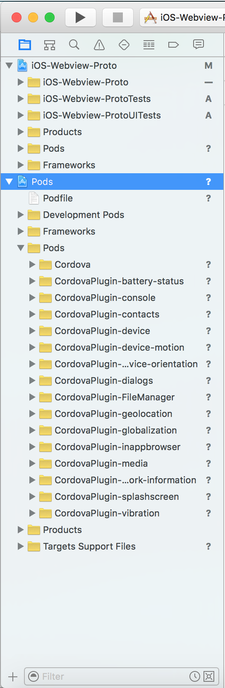
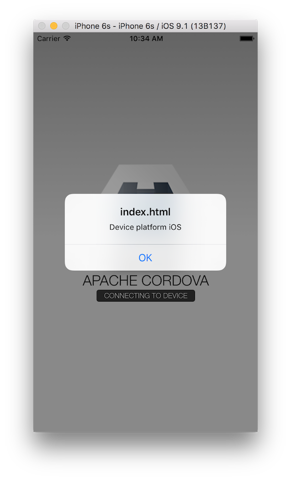
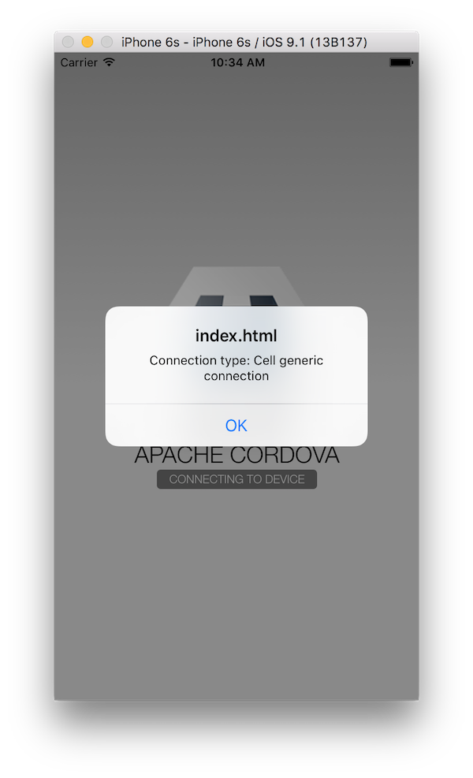
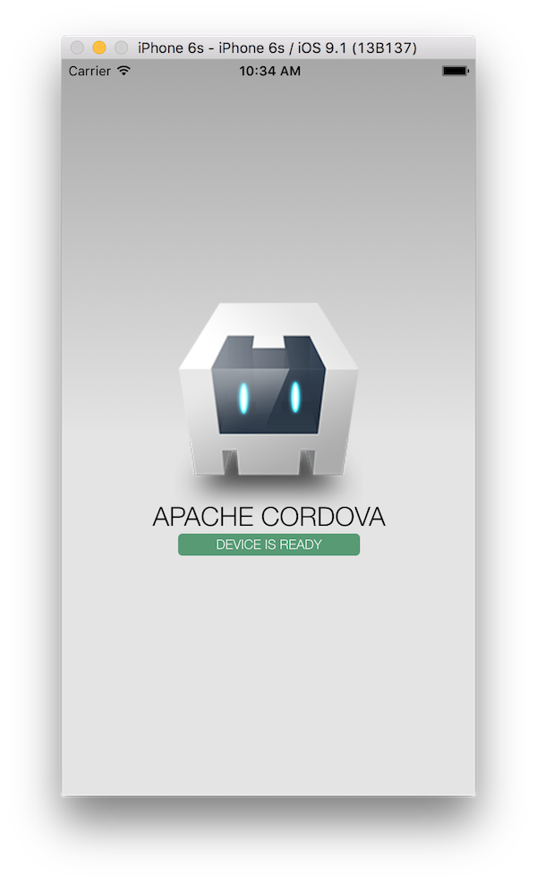

## phonegap-webview-ios

The required resources and instructions for embedding a PhoneGap webview into an iOS Native Project quickly.  

### Quick Start Usage
1. Add the following to your native iOS project Podfile to get this dependency from the CocoaPods registry:	
		
		pod 'phonegap-ios-template'	
	
2. Install the pods referenced in the Podfile from the command line using the CocoaPods `pod` command:

		pod install
	
3. Close your native Xcode project and open the newly created `.xcworkspace` project in the same folder which now includes 
all of the Cordova dependency pods. 

4. You're ready to use any of the Cordova dependencies, for example the `CDVViewController`. See below for further details. 

### Detailed Usage - Embedding Cordova in a Native iOS Project
[Short Demo Video](https://www.youtube.com/watch?v=AzGmTeMsXxI)

**NOTE:** This project assumes you have [previously installed CocoaPods](https://guides.cocoapods.org/using/getting-started.html) 

1. Create a Native Xcode Project - for example using the Single View Controller project template

2. Create a `Podfile` in the root of your project from the command line 
  - Type `pod init` to create a base Podfile
  - Open it and replace the contents with those from the [Podfile_sample](Podfile_sample) prior to the `target` specification lines ([see demo video](https://www.youtube.com/watch?v=AzGmTeMsXxI))  
3. Run `pod install` from command line to install the Cordova dependencies
4. Close your Xcode project 
5. Open the newly created `.xcworkspace` file created from the `pod install`. 

6. Note the new Pods folder with the Cordova dependencies is now included:

7. Now use a Cordova View in your native project. Open the **Main.storyboard** file 
and change the Custom Class value from the default `ViewController` to a `CDVViewController` in the *Identity Inspector*  

### Run it
Build/run the app in Xcode. You should see the custom iOS template version of the PhoneGap Hello world sample running with the Device Ready event firing and 
some messages indicating the use of some of the dependent plugins to ensure they've been properly referenced. 

**NOTE:** The [index.js](resources/www/js/index.js) code in the template project includes references to the device and network information plugins to 
quickly test plugin setup.   

	

### Tips
- Be sure to change the `target` name to your native project target name in the Podfile and ensure Podfile is in the root directory of your Xcode project
- You may need to change the version of platform specified or specify certain versions for other plugins.
- If you update anything in the podfile where you have to run a `pod install` again, you must close the Workspace project in Xcode and open the newly generated one. 

